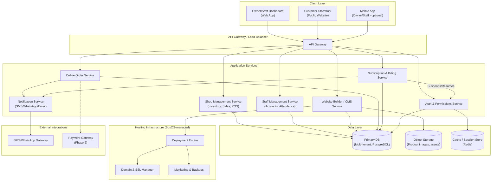
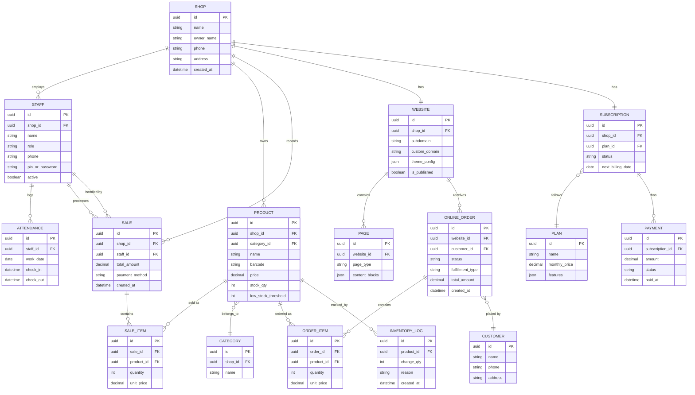
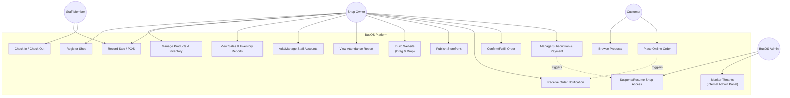

Here's Mermaid code for all three diagrams, based on the tightened BusOS scope (Lite ERP + Staff + Website Builder + Hosting, SaaS model).

## 1. Architecture Diagram

## 2. Entity Relationship Diagram (ERD)

## 3. Use Case Diagram

A few notes:
- The ERD assumes multi-tenancy via `shop_id` foreign keys on nearly every table — that's the isolation model for your SaaS setup.
- The architecture diagram keeps Payment Gateway and full automation as dotted/Phase 2 lines since they're not in MVP scope.
- Paste any of these directly into a Mermaid live editor, Notion, Obsidian, or GitHub markdown (which renders Mermaid natively) to preview them.

Want me to also render one of these as an actual visual diagram inline here, rather than just code?